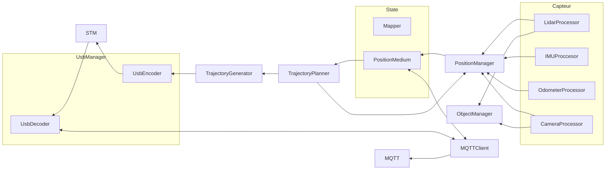

# Rosatelyon

# How to use
```sh
cargo run
```
# Wanted Architecture

```mermaid
flowchart RL
    STM
    subgraph ide1 [UsbManager]
        UsbDecoder
        UsbEncoder
    end
    STM --> UsbDecoder
    UsbEncoder --> STM

    subgraph ide2 [Capteur]
        LidarProcessor
        IMUProccesor
        OdometerProcessor
        CameraProcessor
    end

    LidarProcessor --> PositionManager
    IMUProccesor --> PositionManager
    OdometerProcessor --> PositionManager
    CameraProcessor --> PositionManager

    CameraProcessor --> ObjectManager
    LidarProcessor --> ObjectManager

    subgraph ide3 [State]
        Mapper
        PositionMedium
    end

    MQTTClient <--> PositionMedium
    MQTTClient <--> UsbDecoder

    TrajectoryPlanner --> TrajectoryGenerator
    TrajectoryGenerator --> UsbEncoder

    PositionMedium --> TrajectoryPlanner
    TrajectoryPlanner --> PositionManager
    PositionManager --> PositionMedium
    MQTTClient --> MQTT
```
