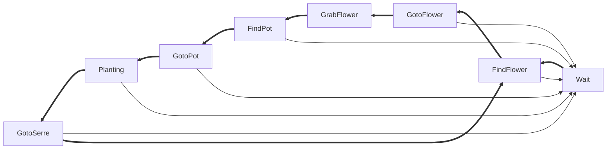

## Strategy

```mermaid
flowchart RL
    Wait ==> FindFlower
    FindFlower ==> GotoFlower --> Wait
    GotoFlower ==> GrabFlower
    GrabFlower ==> FindPot --> Wait
    FindPot ==> GotoPot --> Wait
    GotoPot ==> Planting --> Wait
    Planting ==> GotoSerre --> Wait
    GotoSerre ==> FindFlower --> Wait

```
